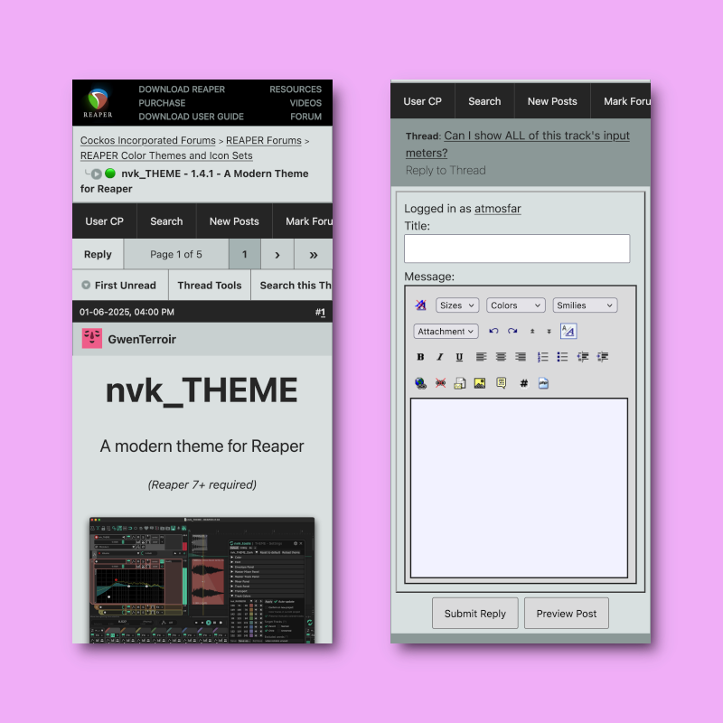

# REAPER Forum Mobile Theme

This theme uses CSS and JavaScript to make the REAPER forum (aka Cockos Incorporated Forums) usable on a mobile device. It was designed with Firefox for Android in mind, and is untested on other platforms.

This project is very much a work in progress and is far from feature-complete. The main pages such as reading the forum index, viewing threads, and replying to posts are working. Many of the less commonly accessed pages have not been included in the theme yet.

## Installation

You will need two browser extensions: [Tampermonkey](https://www.tampermonkey.net/), and [Stylus](https://add0n.com/stylus.html).

- Tampermonkey is needed to inject a `<viewport>` html element into the page, so that the scaling works correctly.
- Stylus is needed to apply the custom CSS styling to the page, which 99% of the work.

Both of these extensions come with their own security considerations, so please be aware of what you are doing with these. They are available for Firefox through Mozilla Add-Ons:

- [Get Tampermonkey for Firefox](https://addons.mozilla.org/en-US/android/addon/tampermonkey/)
- [Get Stylus for Firefox](https://addons.mozilla.org/en-US/android/addon/styl-us/)

Once you have the add-ons installed in your mobile browser, install the theme components through the links below. Their URLs are formatted in a way which should be recognized by the add-ons and prompt you to install them.

- [Tampermonkey JavaScript](https://github.com/atmosfar/reaper_forum_mobile_theme/raw/refs/heads/main/src/reaper_forum_mobile_theme.user.js)
- [Stylus CSS](https://github.com/atmosfar/reaper_forum_mobile_theme/raw/refs/heads/main/src/reaper_forum_mobile_theme.user.css)
- 

## Updating

An installed theme can be updated through the Stylus extension, or forced by re-installing from the above link.
